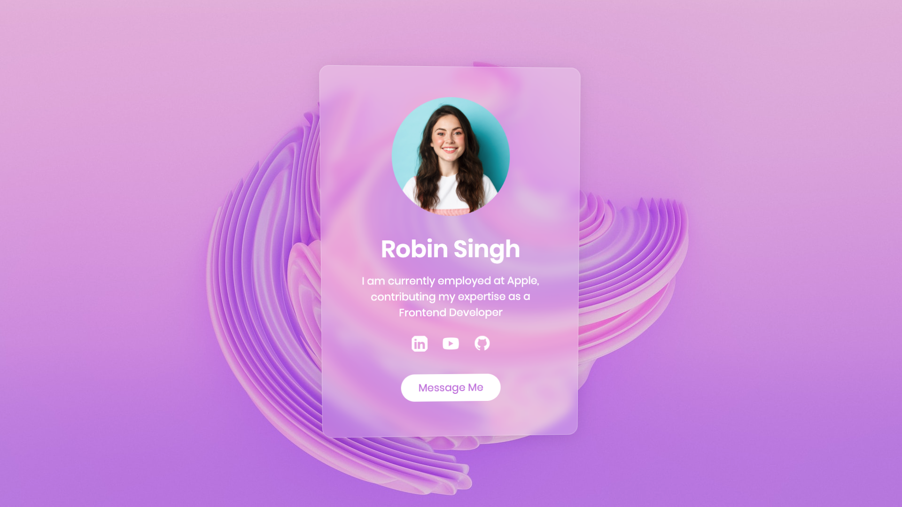

# Glassmorphism Web Design Using HTML CSS | Glassmorphism Card Design

Glassmorphism is a modern web design trend that creates a sleek and transparent glass-like UI aesthetic. This effect uses blurred and semi-transparent backgrounds, along with vivid colors and soft shadows, to give the illusion of frosted glass, adding depth and visual appeal to elements on a webpage. In the context of a card design, glassmorphism is employed to create visually striking and immersive card components, typically used for showcasing content, products, or information. By utilizing HTML for the structure and CSS for styling, including properties like backdrop-filter, box-shadow, and background-blur, developers can achieve the glassmorphism effect. This design approach aims to provide a contemporary and elegant look, enhancing the overall user experience by offering a sophisticated and modern visual presentation. Glassmorphism card designs are often used in various web interfaces, such as landing pages, portfolios, and product showcases, to create a professional and visually appealing user interface that captivates and engages website visitors.

Youtube Tutorial Link: https://youtu.be/r6sVNj7p7uE

Live Preview: https://glassmorphismcard-kappa.vercel.app/

